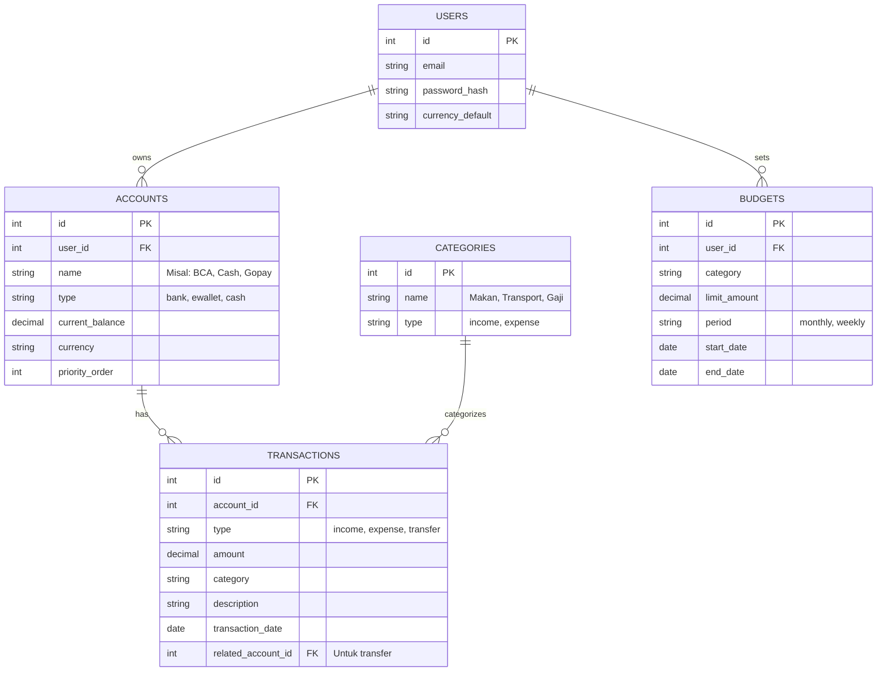

# PRD — Project Requirements Document

## 1. Overview
**Masalah:**
Pengguna saat ini kesulitan memantau kekayaan mereka karena uang tersebar di berbagai tempat (Tunai, Rekening Bank berbeda, dan E-Wallet). Aplikasi keuangan yang ada seringkali rumit, mengharuskan sinkronisasi cloud yang rentan privasi, atau tidak bisa membedakan antara "pengeluaran nyata" dengan "pemindahan uang antar akun".

**Tujuan:**
Membuat aplikasi pencatatan keuangan *mobile-first* (berbasis Android) yang berfokus pada privasi dan kemudahan penggunaan. Aplikasi ini memungkinkan pengguna melihat total kekayaan dari satu dashboard, mencatat arus uang dengan akurat (termasuk transfer internal), dan mengontrol pengeluaran melalui fitur budgeting. Seluruh data disimpan secara lokal di perangkat pengguna (*Local Only*) untuk menjamin keamanan dan privasi tanpa ketergantungan internet.

## 2. Requirements
*   **Platform:** Aplikasi Android (dikembangkan sebagai Web App responsif yang dapat diinstal/PWA atau dibungkus menggunakan Capacitor).
*   **Penyimpanan Data:** 100% Lokal (*Local Storage/SQLite*). Tidak ada data transaksi yang dikirim ke server cloud.
*   **Keamanan:** Autentikasi sederhana (Email/Password) untuk mengunci akses aplikasi di perangkat, meskipun data disimpan lokal.
*   **Mata Uang:** Mendukung multi-mata uang (default IDR), dengan kemampuan pencatatan dalam mata uang asing jika diperlukan.
*   **Kinerja:** Aplikasi harus dapat dibuka dan digunakan sepenuhnya dalam mode *offline* (tanpa internet).
*   **Notifikasi:** Menggunakan notifikasi lokal perangkat untuk peringatan budget dan ringkasan.
*   **Prioritas Akun:** Sistem harus mendukung urutan prioritas: Uang Tunai (Default), Bank Nasional/Digital, lalu E-Wallet.

## 3. Core Features
1.  **Dashboard & Monitoring Saldo:**
    *   Menampilkan total kekayaan gabungan dari semua sumber (Cash + Bank + E-Wallet).
    *   Daftar singkat saldo per akun (BCA, Dana, Cash, dll).
    *   Visualisasi grafik sederhana (Pie/Bar Chart) untuk pemasukan vs pengeluaran bulan ini.
2.  **Manajemen Akun (Wallet):**
    *   Pengguna bisa menambah, mengedit, atau menyembunyikan akun.
    *   Kategori akun: Cash, Bank (BCA, Mandiri, dll), E-Wallet (Gopay, OVO, dll).
3.  **Pencatatan Transaksi (Income & Expense):**
    *   Input jumlah, tanggal, kategori, dan catatan.
    *   Memilih akun sumber/tujuan dari dropdown (misal: Gaji masuk ke BCA).
4.  **Transfer Antar Akun (Internal Mutation):**
    *   Fitur khusus untuk memindahkan saldo (misal: Tarik Tunai BCA -> Cash).
    *   Sistem tidak menghitung ini sebagai pengeluaran/pemasukan, hanya pemindahan saldo agar total kekayaan tetap akurat.
5.  **Budgeting & Alerts:**
    *   Pengguna menetapkan batas pengeluaran per kategori (misal: Makan Rp 1.000.000).
    *   Notifikasi peringatan jika pengeluaran mendekati atau melewati batas.
6.  **Laporan & Analitik:**
    *   Ringkasan harian dan bulanan.
    *   Filter laporan berdasarkan rentang waktu dan kategori.

## 4. User Flow
1.  **Onboarding:** User membuka aplikasi -> Login/Register (Local Auth) -> Masuk ke Dashboard.
2.  **Setup Awal:** User menambahkan akun pertama (misal: Uang Cash) -> Menambahkan akun Bank/E-wallet lainnya.
3.  **Transaksi Harian:**
    *   User menerima gaji -> Pilih "Tambah Pemasukan" -> Masukkan nominal -> Pilih Akun "BCA" -> Simpan.
    *   User belanja makan -> Pilih "Tambah Pengeluaran" -> Masukkan nominal -> Pilih Kategori "Makan" -> Pilih Akun "Cash" -> Simpan.
    *   User Top-up E-wallet -> Pilih "Transfer" -> Dari "BCA" ke "Gopay" -> Simpan.
4.  **Monitoring:** User membuka Dashboard -> Melihat grafik pengeluaran -> Melihat sisa budget kategori "Makan".
5.  **Alert:** Jika budget "Makan" hampir habis -> Muncul notifikasi lokal di HP user.

## 5. Architecture
Sistem dirancang dengan arsitektur *Local-First*. Logika bisnis berjalan di sisi klien (perangkat pengguna). Database SQLite berjalan secara lokal di dalam lingkungan aplikasi. Tidak ada API backend eksternal untuk transaksi, memastikan kecepatan dan privasi.

```mermaid
flowchart TD
    User[Pengguna Android] -->|Interaksi UI| Frontend[Frontend App Next.js]
    
    subgraph "Device Environment (Lokal)"
        Frontend -->|Query/Data| AuthModule[Modul Auth (Better Auth Local)]
        Frontend -->|Read/Write| DB[(Database SQLite Lokal)]
        Frontend -->|Trigger| Notif[Notifikasi Lokal]
        Logic[Logic Bisnis & Kalkulasi] -->|Update| DB
        Frontend -->|Proses| Logic
    end

    DB -->|Menyimpan| DataTransaksi[Data Transaksi & Saldo]
    DB -->|Menyimpan| DataAkun[Data Akun & Budget]
    
    style User fill:#f9f,stroke:#333,stroke-width:2px
    style DB fill:#ff9,stroke:#333,stroke-width:2px
    style Frontend fill:#bbf,stroke:#333,stroke-width:2px
```

## 6. Database Schema
Database menggunakan SQLite untuk penyimpanan lokal yang ringan dan cepat. Berikut adalah rancangan tabel utamanya:



**Penjelasan Field Utama:**
*   **ACCOUNTS:** Menyimpan sumber uang. `priority_order` digunakan untuk mengurutkan tampilan (Cash dulu, lalu Bank, lalu E-wallet).
*   **TRANSACTIONS:** Mencatat arus uang. Jika `type` adalah "transfer", maka `related_account_id` akan terisi (menandakan uang pindah dari akun A ke B).
*   **BUDGETS:** Menyimpan target pengeluaran. Aplikasi akan menjumlahkan transaksi kategori terkait dan membandingkannya dengan `limit_amount`.

## 7. Tech Stack
Berdasarkan standar pengembangan modern dan kebutuhan aplikasi yang responsif serta lokal, berikut adalah rekomendasi teknologi:

*   **Frontend:** **Next.js** dengan **Tailwind CSS**.
    *   *Alasan:* Memungkinkan pengembangan cepat dengan komponen UI yang konsisten. Menggunakan **shadcn/ui** untuk komponen siap pakai yang terlihat profesional (tombol, input, kartu, dialog).
*   **Mobile Adaptation:** **Capacitor** atau **PWA (Progressive Web App)**.
    *   *Alasan:* Karena inti stack adalah Next.js (Web), kita akan membungkusnya menggunakan Capacitor agar bisa diinstal sebagai aplikasi Android native (.apk) dan mengakses fitur perangkat seperti notifikasi lokal.
*   **Database:** **SQLite** (via **Drizzle ORM**).
    *   *Alasan:* SQLite sangat ringan, tidak butuh server database terpisah, dan cocok untuk penyimpanan lokal di perangkat mobile. Drizzle ORM memudahkan interaksi dengan database menggunakan TypeScript.
*   **Authentication:** **Better Auth**.
    *   *Alasan:* Menyediakan manajemen sesi dan keamanan password yang standar meskipun berjalan secara lokal/edge.
*   **Deployment:** **Vercel** (untuk build web) atau **Google Play Store** (setelah di-wrap menjadi APK).
    *   *Catatan:* Karena fitur "Local Only", deployment server hanya diperlukan untuk mendistribusikan file aplikasi, bukan untuk menyimpan data user.